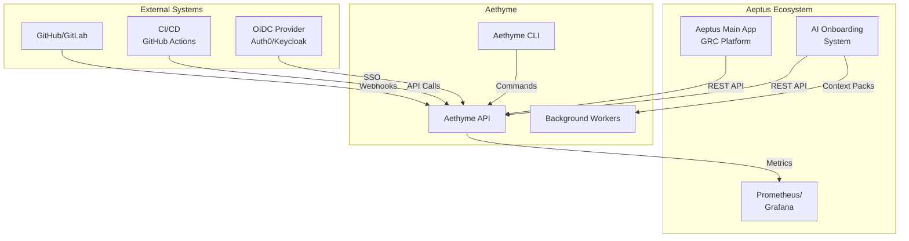
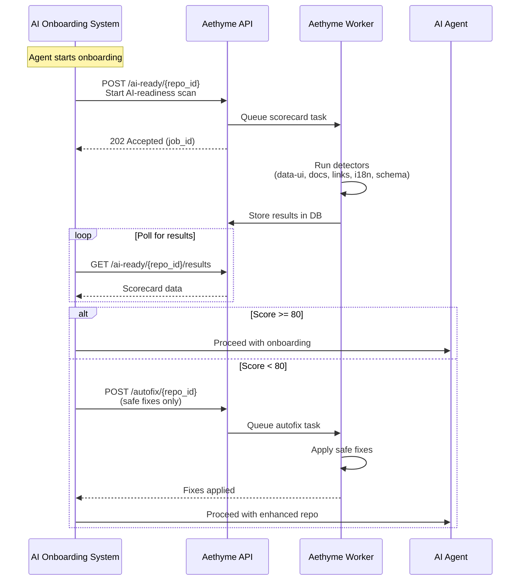
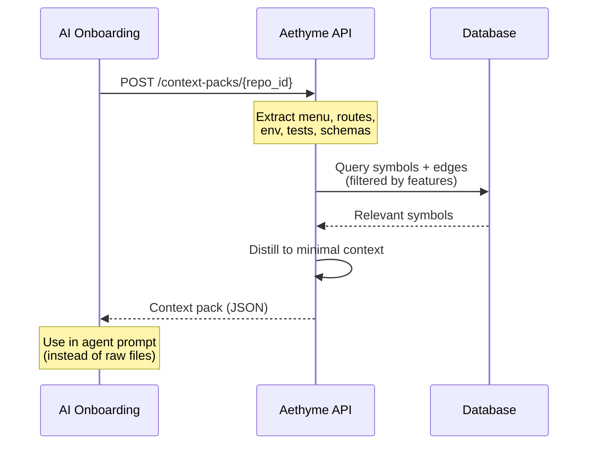
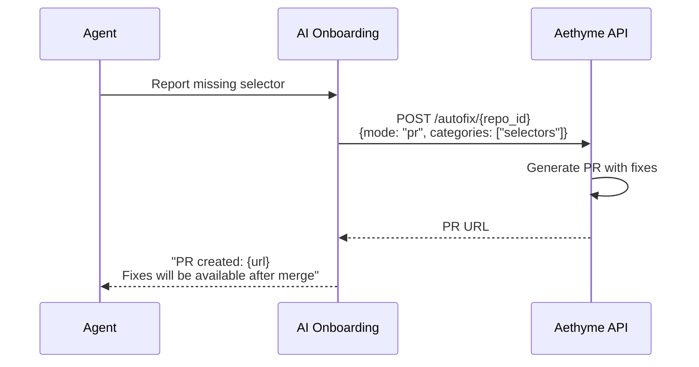
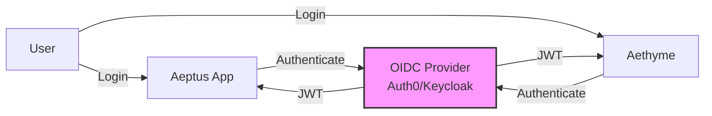
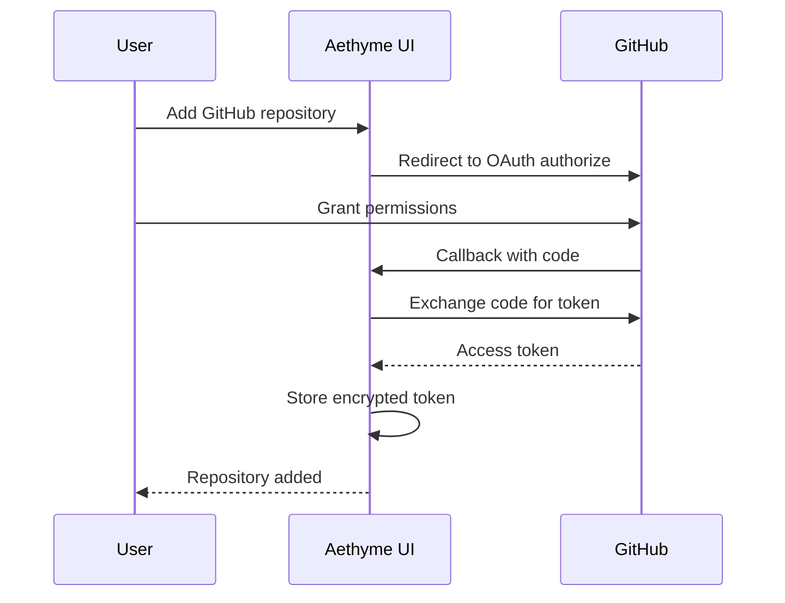

# Aethyme Integration Points

**Version:** 1.0
**Date:** 2025-11-22
**Status:** Design Complete

---

## Table of Contents

1. [Overview](#overview)
2. [A. AI Onboarding System Integration](#a-ai-onboarding-system-integration)
3. [B. Aeptus Main Application Integration](#b-aeptus-main-application-integration)
4. [C. GitHub/GitLab Integration](#c-githubgitlab-integration)
5. [D. CI/CD Pipeline Integration](#d-cicd-pipeline-integration)
6. [E. Monitoring & Observability Integration](#e-monitoring--observability-integration)

---

## Overview

Aethyme integrates with multiple systems in the Aeptus ecosystem:



**Integration Patterns:**

| Integration | Pattern | Direction | Protocol |
|-------------|---------|-----------|----------|
| **AI Onboarding** | Request/Response + Events | Bidirectional | REST API + Webhooks |
| **Aeptus Main App** | Shared Auth + API Calls | Bidirectional | OIDC + REST API |
| **GitHub/GitLab** | Webhooks + OAuth | Inbound | Webhooks + OAuth 2.0 |
| **CI/CD** | API Client | Inbound | REST API (API Keys) |
| **Monitoring** | Metrics Export | Outbound | Prometheus Metrics |

---

## A. AI Onboarding System Integration

**Reference:** `Mockup/docs/AI_ONBOARDING_CUTTING_EDGE_IDEAS.md`

**Integration Goal:** Use Aethyme's AI-readiness features to enhance agent onboarding workflow.

### 1. AI-Readiness Scorecard in Onboarding

**Flow:**



**API Endpoints Used:**

```bash
# 1. Trigger AI-readiness scan
POST /api/v1/ai-ready/{repo_id}
Authorization: Bearer {jwt_token}

# Response:
{
  "job_id": "job_abc123",
  "status": "pending",
  "estimated_duration_seconds": 120
}

# 2. Get scorecard results
GET /api/v1/ai-ready/{repo_id}/results
Authorization: Bearer {jwt_token}

# Response:
{
  "repo_id": "repo_xyz",
  "score": 78,
  "summary": {
    "total_violations": 15,
    "blockers": 2,
    "warnings": 8,
    "info": 5
  },
  "violations": [
    {
      "severity": "blocker",
      "category": "data-ui",
      "message": "Missing data-ui selector on button",
      "file": "src/components/Button.tsx",
      "line": 42
    }
  ],
  "created_at": "2025-11-22T10:30:00Z"
}

# 3. Trigger autofixes
POST /api/v1/autofix/{repo_id}
Authorization: Bearer {jwt_token}
Content-Type: application/json

{
  "mode": "safe_only",  // or "dry_run", "pr"
  "categories": ["docs", "links", "selectors"]
}

# Response:
{
  "job_id": "job_def456",
  "fixes_applied": 8,
  "fixes_skipped": 2,
  "details": {
    "docs_regen": 3,
    "link_fixes": 5
  }
}
```

### 2. Context Pack Generation (S1-T11)

**Purpose:** Generate distilled context for AI agents (60-70% token savings vs raw files).

**Flow:**



**API Endpoint:**

```bash
POST /api/v1/context-packs/{repo_id}
Authorization: Bearer {jwt_token}
Content-Type: application/json

{
  "features": ["menu", "routes", "env", "tests", "schemas"],
  "language": "typescript",
  "max_symbols": 500
}

# Response:
{
  "repo_id": "repo_xyz",
  "features": {
    "menu": {
      "config_file": "apps/customer/src/config/menu.config.ts",
      "structure": {
        "dashboard": ["home", "analytics"],
        "suppliers": ["list", "create", "edit"],
        "controls": ["framework", "testing"]
      }
    },
    "routes": [
      {"path": "/suppliers", "component": "SuppliersPage", "role": "member"},
      {"path": "/suppliers/:id", "component": "SupplierDetailPage", "role": "member"}
    ],
    "env": {
      "required": ["VITE_API_URL", "VITE_AUTH0_DOMAIN"],
      "optional": ["VITE_SENTRY_DSN"]
    },
    "tests": {
      "framework": "vitest",
      "coverage": 75,
      "data_ui_coverage": 100
    },
    "schemas": {
      "Supplier": {
        "fields": ["id", "name", "risk_score", "status"],
        "api": "/api/suppliers"
      }
    }
  },
  "metadata": {
    "tokens_saved": 15000,
    "compression_ratio": 0.68,
    "generated_at": "2025-11-22T10:30:00Z"
  }
}
```

**Integration in Onboarding:**

```javascript
// scripts/ai/onboard.mjs (enhanced)

import { AethymeClient } from './aethyme-client.mjs';

class AethymeOnboarding {
  async onboard(agentId, options) {
    const rg = new AethymeClient(process.env.AETHYME_API_URL);

    // 1. Check AI-readiness
    const scorecard = await rg.getScorecard('aeptus-main');
    console.log(`AI-Readiness Score: ${scorecard.score}/100`);

    if (scorecard.score < 80) {
      console.log('Running safe autofixes...');
      await rg.runAutofixes('aeptus-main', { mode: 'safe_only' });
    }

    // 2. Get context pack
    const contextPack = await rg.getContextPack('aeptus-main', {
      features: ['menu', 'routes', 'env', 'tests', 'schemas']
    });

    console.log(`Context pack generated (${contextPack.metadata.tokens_saved} tokens saved)`);

    // 3. Use context pack in agent prompt
    const enhancedPrompt = `
    You are onboarding to the Aeptus platform.

    ## Menu Structure
    ${JSON.stringify(contextPack.features.menu.structure, null, 2)}

    ## Available Routes
    ${contextPack.features.routes.map(r => `- ${r.path} (${r.role})`).join('\n')}

    ## Environment Variables
    Required: ${contextPack.features.env.required.join(', ')}

    ## Key Schemas
    ${Object.keys(contextPack.features.schemas).map(s => `- ${s}`).join('\n')}

    Now proceed with standard onboarding...
    `;

    return await this.standardOnboarding(agentId, enhancedPrompt);
  }
}
```

**Benefits:**
- **60-70% token savings** - Context packs vs raw files
- **Automated prep** - Autofixes run before onboarding
- **Quality gates** - Only onboard to repos scoring 80+
- **Faster understanding** - Distilled info vs exploring codebase

### 3. Autofix Integration in Onboarding Workflow

**Scenario:** Agent discovers missing data-ui selectors during onboarding.

**Flow:**



**API Call:**

```bash
POST /api/v1/autofix/{repo_id}
Authorization: Bearer {jwt_token}

{
  "mode": "pr",
  "categories": ["selectors"],
  "target_branch": "main",
  "pr_title": "fix: add missing data-ui selectors",
  "pr_body": "Automated fix from Aethyme AI-readiness scan"
}

# Response:
{
  "pr_url": "https://github.com/acme/repo/pull/123",
  "fixes_applied": 5,
  "files_changed": ["src/components/Button.tsx", "src/pages/SupplierForm.tsx"]
}
```

---

## B. Aeptus Main Application Integration

**Reference:** Existing Aeptus GRC platform

**Integration Goal:** Shared authentication, org management, and code intelligence queries.

### 1. Shared Authentication (OIDC)

**Architecture:**



**JWT Claims (Shared):**

```json
{
  "sub": "user_abc123",           // User ID (shared across apps)
  "org_id": "org_xyz789",         // Organization ID (shared)
  "email": "user@acme.com",
  "name": "Jane Doe",
  "roles": ["admin"],             // Aeptus roles
  "aethyme_scopes": ["repo:read", "repo:write", "query:*"],
  "iss": "https://auth.aeptus.com",
  "aud": ["aeptus-api", "aethyme-api"],
  "exp": 1700000000
}
```

**Configuration:**

```yaml
# Aethyme OIDC Config
OIDC_PROVIDER: "https://auth.aeptus.com"
OIDC_CLIENT_ID: "aethyme-api"
OIDC_CLIENT_SECRET: "${OIDC_CLIENT_SECRET}"  # From vault
OIDC_REDIRECT_URI: "https://app.aethyme.com/auth/callback"
OIDC_SCOPES: "openid profile email org_id"

# Shared org_id claim
JWT_ORG_CLAIM: "org_id"
```

**FastAPI Integration:**

```python
from fastapi import Depends, HTTPException
from fastapi.security import OAuth2AuthorizationCodeBearer
from jose import jwt, JWTError

oauth2_scheme = OAuth2AuthorizationCodeBearer(
    authorizationUrl=f"{OIDC_PROVIDER}/authorize",
    tokenUrl=f"{OIDC_PROVIDER}/oauth/token"
)

async def get_current_user(token: str = Depends(oauth2_scheme)):
    """Validate JWT from OIDC provider."""
    try:
        payload = jwt.decode(
            token,
            OIDC_PUBLIC_KEY,
            algorithms=["RS256"],
            audience="aethyme-api"
        )

        user_id = payload["sub"]
        org_id = payload["org_id"]

        # Set PostgreSQL session variable for RLS
        await db.execute(f"SET app.current_org = '{org_id}'")

        return {
            "user_id": user_id,
            "org_id": org_id,
            "email": payload.get("email"),
            "scopes": payload.get("aethyme_scopes", [])
        }

    except JWTError:
        raise HTTPException(401, "Invalid token")
```

### 2. Shared Org/Tenant Model

**Design:** Both Aeptus and Aethyme share the same organization IDs.

**Database Sync:**

```sql
-- Aeptus database
CREATE TABLE organizations (
    id UUID PRIMARY KEY,  -- Same UUID used in Aethyme
    name VARCHAR(255),
    created_at TIMESTAMP
);

-- Aethyme database
CREATE TABLE orgs (
    id UUID PRIMARY KEY,  -- Same UUID from Aeptus
    name VARCHAR(255),
    slug VARCHAR(100),
    created_at TIMESTAMP
);
```

**Sync Strategy:**

1. **Event-driven:** Aeptus publishes org.created/org.updated events
2. **Aethyme subscribes:** Creates/updates org records
3. **Webhook endpoint:** `POST /webhooks/aeptus/org-events`

**Webhook Payload:**

```json
{
  "event": "org.created",
  "data": {
    "org_id": "org_abc123",
    "name": "Acme Corporation",
    "slug": "acme-corp"
  },
  "timestamp": "2025-11-22T10:30:00Z",
  "signature": "sha256=..."  // HMAC signature for verification
}
```

**Aethyme Webhook Handler:**

```python
@app.post("/webhooks/aeptus/org-events")
async def handle_aeptus_org_event(request: Request):
    """Handle org lifecycle events from Aeptus."""

    # 1. Verify webhook signature
    signature = request.headers.get("X-Aeptus-Signature")
    body = await request.body()
    if not verify_signature(body, signature, AEPTUS_WEBHOOK_SECRET):
        raise HTTPException(401, "Invalid signature")

    # 2. Parse event
    event = await request.json()

    # 3. Handle event
    if event["event"] == "org.created":
        await db.insert_org({
            "id": event["data"]["org_id"],
            "name": event["data"]["name"],
            "slug": event["data"]["slug"]
        })

    elif event["event"] == "org.updated":
        await db.update_org(event["data"]["org_id"], {
            "name": event["data"]["name"],
            "slug": event["data"]["slug"]
        })

    elif event["event"] == "org.deleted":
        await db.soft_delete_org(event["data"]["org_id"])

    return {"status": "ok"}
```

### 3. API Endpoints Aeptus Will Call

**Use Cases:**

1. **Code Intelligence Widget** - Show symbol graph in Aeptus UI
2. **Impact Analysis** - Analyze impact of code changes on compliance controls
3. **Search** - Search codebase from Aeptus interface

**Endpoints:**

```bash
# 1. Search symbols (called from Aeptus search bar)
GET /api/v1/query/search?q=AuthMiddleware&org_id={org_id}
Authorization: Bearer {aeptus_jwt_token}

# Response:
{
  "results": [
    {
      "symbol": "AuthMiddleware.authenticate",
      "file": "backend/auth/middleware.py",
      "line": 42,
      "kind": "method",
      "signature": "def authenticate(self, request: Request) -> User"
    }
  ],
  "total": 5,
  "query_time_ms": 23
}

# 2. Ego graph (called from Aeptus symbol detail page)
GET /api/v1/query/ego?symbol=AuthMiddleware.authenticate&depth=2
Authorization: Bearer {aeptus_jwt_token}

# 3. Impact analysis (called when reviewing code changes)
GET /api/v1/query/impact?symbol=User.roles&depth=3
Authorization: Bearer {aeptus_jwt_token}
```

**Aeptus Frontend Integration:**

```typescript
// Aeptus app: Code intelligence widget

import { AethymeClient } from '@aeptus/aethyme-client';

const AethymeWidget: React.FC = () => {
  const [graph, setGraph] = useState(null);
  const { accessToken } = useAuth();  // Shared JWT

  useEffect(() => {
    const client = new AethymeClient({
      apiUrl: 'https://api.aethyme.com/api/v1',
      accessToken
    });

    client.getEgoGraph('AuthMiddleware.authenticate', 2)
      .then(setGraph);
  }, []);

  return <GraphVisualization data={graph} />;
};
```

### 4. Webhooks for Repo Changes

**Flow:** Aethyme notifies Aeptus when repositories are indexed.

**Webhook Configuration (in Aeptus settings):**

```json
{
  "webhook_url": "https://api.aeptus.com/webhooks/aethyme",
  "events": ["repo.indexed", "scorecard.completed"],
  "secret": "whsec_..."  // For signature verification
}
```

**Payload:**

```json
{
  "event": "repo.indexed",
  "data": {
    "repo_id": "repo_abc123",
    "org_id": "org_xyz789",
    "name": "aeptus-main",
    "symbol_count": 1234,
    "indexed_at": "2025-11-22T10:30:00Z"
  },
  "timestamp": "2025-11-22T10:30:05Z",
  "signature": "sha256=..."
}
```

**Aeptus Handler:**

```python
@app.post("/webhooks/aethyme")
async def handle_aethyme_webhook(request: Request):
    """Handle events from Aethyme."""

    # Verify signature
    signature = request.headers.get("X-Aethyme-Signature")
    body = await request.body()
    if not verify_signature(body, signature, AETHYME_WEBHOOK_SECRET):
        raise HTTPException(401, "Invalid signature")

    event = await request.json()

    if event["event"] == "repo.indexed":
        # Update Aeptus UI to show new code intelligence data
        await notify_ui_refresh(event["data"]["repo_id"])

    return {"status": "ok"}
```

---

## C. GitHub/GitLab Integration

**Integration Goal:** Automatically index repositories on push, provide PR feedback.

### 1. OAuth for Repo Access

**Flow:**



**OAuth Scopes Required:**

```
GitHub:
  - repo          # Access private repositories
  - read:org      # Read organization membership
  - admin:repo_hook  # Create webhooks

GitLab:
  - api           # Full API access
  - read_repository
  - write_repository
```

**Configuration:**

```bash
# GitHub OAuth App
GITHUB_CLIENT_ID="Iv1.abc123"
GITHUB_CLIENT_SECRET="${GITHUB_CLIENT_SECRET}"
GITHUB_REDIRECT_URI="https://app.aethyme.com/auth/github/callback"

# GitLab OAuth App
GITLAB_CLIENT_ID="xyz789"
GITLAB_CLIENT_SECRET="${GITLAB_CLIENT_SECRET}"
GITLAB_REDIRECT_URI="https://app.aethyme.com/auth/gitlab/callback"
```

**Token Storage (Encrypted):**

```sql
CREATE TABLE oauth_tokens (
    id UUID PRIMARY KEY,
    org_id UUID REFERENCES orgs(id),
    provider VARCHAR(50),  -- 'github', 'gitlab'
    access_token_encrypted TEXT,  -- Encrypted with org-specific key
    refresh_token_encrypted TEXT,
    expires_at TIMESTAMP,
    scopes JSONB
);
```

### 2. Webhook Integration for Push Events

**Setup:**

1. User adds repository
2. Aethyme creates webhook on GitHub/GitLab
3. On push, webhook triggers re-indexing

**Webhook Registration:**

```python
import httpx

async def register_github_webhook(repo_id: str, github_token: str):
    """Register webhook on GitHub repository."""

    repo = await db.get_repo(repo_id)

    # Create webhook
    async with httpx.AsyncClient() as client:
        response = await client.post(
            f"https://api.github.com/repos/{repo.full_name}/hooks",
            headers={
                "Authorization": f"Bearer {github_token}",
                "Accept": "application/vnd.github.v3+json"
            },
            json={
                "name": "web",
                "active": True,
                "events": ["push", "pull_request"],
                "config": {
                    "url": f"{AETHYME_API_URL}/webhooks/github",
                    "content_type": "json",
                    "secret": GITHUB_WEBHOOK_SECRET,
                    "insecure_ssl": "0"
                }
            }
        )

    webhook_id = response.json()["id"]
    await db.update_repo(repo_id, {"github_webhook_id": webhook_id})
```

**Webhook Handler:**

```python
@app.post("/webhooks/github")
async def handle_github_webhook(request: Request):
    """Handle push events from GitHub."""

    # 1. Verify signature
    signature = request.headers.get("X-Hub-Signature-256")
    body = await request.body()
    if not verify_github_signature(body, signature, GITHUB_WEBHOOK_SECRET):
        raise HTTPException(401, "Invalid signature")

    # 2. Parse payload
    event_type = request.headers.get("X-GitHub-Event")
    payload = await request.json()

    # 3. Handle push event
    if event_type == "push":
        repo_url = payload["repository"]["clone_url"]
        branch = payload["ref"].split("/")[-1]

        # Find repo in database
        repo = await db.get_repo_by_url(repo_url)

        if repo and branch == repo.default_branch:
            # Queue re-indexing
            await indexing_service.queue_index_job(repo.id)

    # 4. Handle pull request event
    elif event_type == "pull_request":
        if payload["action"] == "opened":
            # Run scorecard on PR
            await scorecard_service.run_on_pr(payload["pull_request"])

    return {"status": "ok"}
```

### 3. Webhook Payload Handling

**GitHub Push Payload:**

```json
{
  "ref": "refs/heads/main",
  "repository": {
    "id": 123456,
    "name": "aeptus-main",
    "full_name": "acme/aeptus-main",
    "clone_url": "https://github.com/acme/aeptus-main.git"
  },
  "pusher": {
    "name": "jane",
    "email": "jane@acme.com"
  },
  "commits": [
    {
      "id": "abc123...",
      "message": "feat: add new feature",
      "modified": ["src/app.py", "tests/test_app.py"]
    }
  ]
}
```

**Processing:**

1. **Verify signature** - HMAC-SHA256
2. **Extract repo** - Match clone_url to database
3. **Queue indexing** - Celery task
4. **Audit log** - Record webhook received

---

## D. CI/CD Pipeline Integration

**Integration Goal:** Run Aethyme checks in CI pipelines (GitHub Actions, GitLab CI).

### 1. GitHub Actions Integration

**Workflow File:** `.github/workflows/aethyme.yml`

```yaml
name: Aethyme AI-Readiness Check

on:
  pull_request:
    branches: [main, develop]

jobs:
  ai-readiness:
    runs-on: ubuntu-latest
    steps:
      - name: Checkout code
        uses: actions/checkout@v3

      - name: Run Aethyme Scorecard
        uses: aethyme/scorecard-action@v1
        with:
          api_url: https://api.aethyme.com/api/v1
          api_key: ${{ secrets.AETHYME_API_KEY }}
          repo_id: ${{ secrets.AETHYME_REPO_ID }}
          fail_on_score: 80  # Fail if score < 80
          comment_on_pr: true

      - name: Upload scorecard results
        uses: actions/upload-artifact@v3
        with:
          name: scorecard-results
          path: scorecard-results.json
```

**Action Implementation:**

```javascript
// aethyme-action/index.js

const core = require('@actions/core');
const github = require('@actions/github');
const axios = require('axios');

async function run() {
  try {
    const apiUrl = core.getInput('api_url');
    const apiKey = core.getInput('api_key');
    const repoId = core.getInput('repo_id');
    const failOnScore = parseInt(core.getInput('fail_on_score'));
    const commentOnPr = core.getInput('comment_on_pr') === 'true';

    // 1. Trigger scorecard
    const { data: job } = await axios.post(
      `${apiUrl}/ai-ready/${repoId}`,
      {},
      { headers: { 'X-API-Key': apiKey } }
    );

    // 2. Poll for results
    let scorecard;
    while (true) {
      const { data: result } = await axios.get(
        `${apiUrl}/ai-ready/${repoId}/results`,
        { headers: { 'X-API-Key': apiKey } }
      );

      if (result) {
        scorecard = result;
        break;
      }

      await new Promise(resolve => setTimeout(resolve, 5000));
    }

    // 3. Write results file
    fs.writeFileSync('scorecard-results.json', JSON.stringify(scorecard, null, 2));

    // 4. Comment on PR
    if (commentOnPr && github.context.payload.pull_request) {
      const octokit = github.getOctokit(process.env.GITHUB_TOKEN);

      await octokit.rest.issues.createComment({
        owner: github.context.repo.owner,
        repo: github.context.repo.repo,
        issue_number: github.context.payload.pull_request.number,
        body: formatScorecardComment(scorecard)
      });
    }

    // 5. Fail if score too low
    if (scorecard.score < failOnScore) {
      core.setFailed(`AI-readiness score ${scorecard.score} is below threshold ${failOnScore}`);
    } else {
      core.info(`✅ AI-readiness score: ${scorecard.score}/100`);
    }

  } catch (error) {
    core.setFailed(error.message);
  }
}

function formatScorecardComment(scorecard) {
  return `
## 🤖 Aethyme AI-Readiness Score: ${scorecard.score}/100

### Summary
- **Total Violations:** ${scorecard.summary.total_violations}
- **Blockers:** ${scorecard.summary.blockers}
- **Warnings:** ${scorecard.summary.warnings}

### Top Issues
${scorecard.violations.slice(0, 5).map(v => `- [${v.severity.toUpperCase()}] ${v.message} (${v.file}:${v.line})`).join('\n')}

[View full report](https://app.aethyme.com/scorecards/${scorecard.id})
  `;
}

run();
```

### 2. API Key Usage in CI

**Generate API Key:**

```bash
# Via CLI
aethyme api-keys create \
  --name "GitHub Actions" \
  --scopes "ai:scorecard,query:*" \
  --expires-in "1y"

# Output:
# API Key: rgph_live_abc123def456...
# Save this key - it will not be shown again!
```

**Store in GitHub Secrets:**

1. Go to repo Settings → Secrets → Actions
2. Add secret: `AETHYME_API_KEY` = `rgph_live_abc123...`
3. Add secret: `AETHYME_REPO_ID` = `repo_xyz789`

**Rate Limiting for CI:**

```python
# Exempt CI API keys from rate limits
@app.middleware("http")
async def rate_limit_middleware(request: Request, call_next):
    api_key = request.headers.get("X-API-Key")

    if api_key:
        key_data = await db.get_api_key(api_key)
        if "ci:unlimited" in key_data.scopes:
            # Skip rate limiting
            return await call_next(request)

    # Apply rate limiting
    await rate_limiter.check(request.state.org_id)
    return await call_next(request)
```

### 3. Scorecard as PR Check

**GitHub Status Check:**

```python
import httpx

async def post_github_status_check(repo: Repo, commit_sha: str, scorecard: Scorecard):
    """Post scorecard result as GitHub status check."""

    state = "success" if scorecard.score >= 80 else "failure"
    description = f"AI-readiness score: {scorecard.score}/100"

    async with httpx.AsyncClient() as client:
        await client.post(
            f"https://api.github.com/repos/{repo.full_name}/statuses/{commit_sha}",
            headers={
                "Authorization": f"Bearer {github_token}",
                "Accept": "application/vnd.github.v3+json"
            },
            json={
                "state": state,
                "target_url": f"{AETHYME_UI_URL}/scorecards/{scorecard.id}",
                "description": description,
                "context": "Aethyme AI-Readiness"
            }
        )
```

---

## E. Monitoring & Observability Integration

### 1. Prometheus Metrics Export

**Metrics Endpoint:**

```python
from prometheus_client import Counter, Histogram, Gauge, generate_latest

# Metrics
indexing_duration = Histogram(
    'aethyme_indexing_duration_seconds',
    'Time spent indexing repositories',
    ['repo_id', 'status']
)

query_duration = Histogram(
    'aethyme_query_duration_seconds',
    'Query execution time',
    ['query_type', 'cached']
)

api_requests = Counter(
    'aethyme_api_requests_total',
    'Total API requests',
    ['method', 'endpoint', 'status']
)

active_symbols = Gauge(
    'aethyme_symbols_total',
    'Total number of indexed symbols',
    ['org_id', 'language']
)

@app.get("/metrics")
async def metrics():
    """Prometheus metrics endpoint."""
    return Response(generate_latest(), media_type="text/plain")
```

**Scrape Configuration (Prometheus):**

```yaml
# prometheus.yml
scrape_configs:
  - job_name: 'aethyme-api'
    static_configs:
      - targets: ['aethyme-api-1:8000', 'aethyme-api-2:8000']
    scrape_interval: 15s
    metrics_path: /metrics

  - job_name: 'aethyme-workers'
    static_configs:
      - targets: ['aethyme-worker-1:9090', 'aethyme-worker-2:9090']
    scrape_interval: 30s
```

### 2. Grafana Dashboards

**Pre-built Dashboard:** `grafana/aethyme-dashboard.json`

**Panels:**

1. **API Performance**
   - Request rate (req/s)
   - Latency (p50, p95, p99)
   - Error rate

2. **Indexing Performance**
   - Indexing throughput (repos/hour)
   - Average indexing duration
   - Failed indexing jobs

3. **Query Performance**
   - Query latency by type (search, ego, impact)
   - Cache hit rate
   - Slow queries (>2s)

4. **System Health**
   - PostgreSQL connection pool usage
   - Redis memory usage
   - Celery queue length

**Alert Rules:**

```yaml
# alerts.yml
groups:
  - name: aethyme
    rules:
      - alert: HighAPILatency
        expr: histogram_quantile(0.95, aethyme_query_duration_seconds) > 2
        for: 5m
        labels:
          severity: warning
        annotations:
          summary: "API latency p95 > 2s"

      - alert: IndexingFailures
        expr: rate(aethyme_indexing_duration_seconds{status="failed"}[5m]) > 0.1
        for: 10m
        labels:
          severity: critical
        annotations:
          summary: "High indexing failure rate"
```

---

## Summary

**Integration Checklist:**

- [ ] **AI Onboarding:** API endpoints implemented (scorecard, autofix, context packs)
- [ ] **Aeptus:** Shared OIDC, org sync webhooks, API client library
- [ ] **GitHub/GitLab:** OAuth flow, webhook handlers, PR status checks
- [ ] **CI/CD:** GitHub Action published, API key scopes configured
- [ ] **Monitoring:** Prometheus metrics, Grafana dashboards, alerts

**Next Steps:**

1. Implement webhook handlers (GitHub, GitLab, Aeptus)
2. Build API client libraries (TypeScript, Python)
3. Create GitHub Action for CI/CD
4. Set up Grafana dashboards
5. Document integration guides for each system

---

**Document Status:** ✅ Complete - Ready for Implementation
**Dependencies:** Stage 1 API implementation, OIDC provider setup
