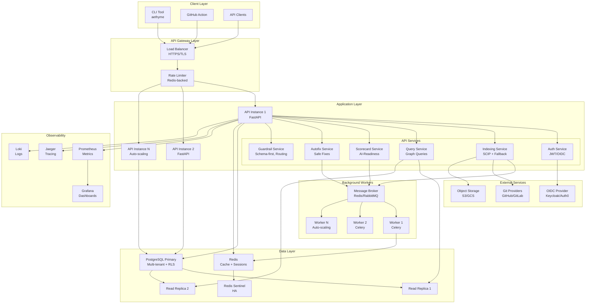
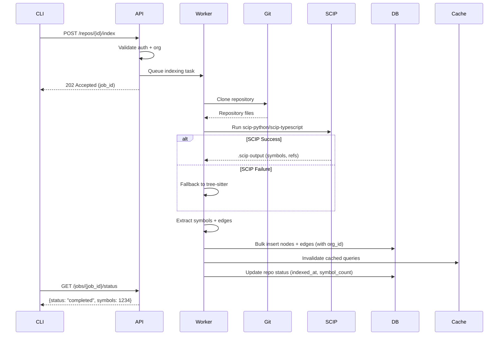
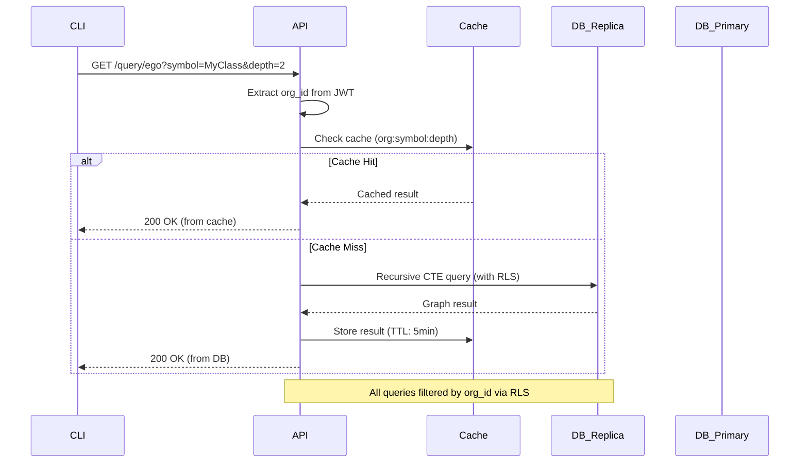
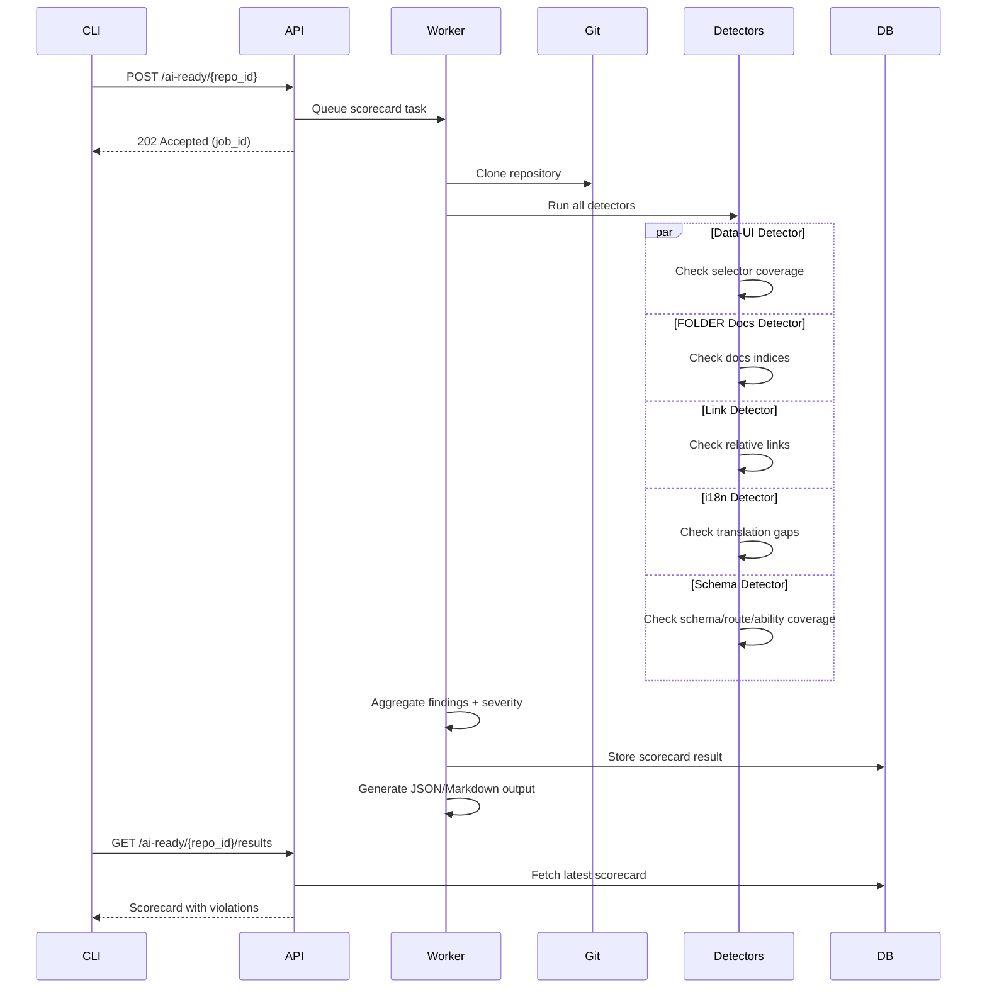
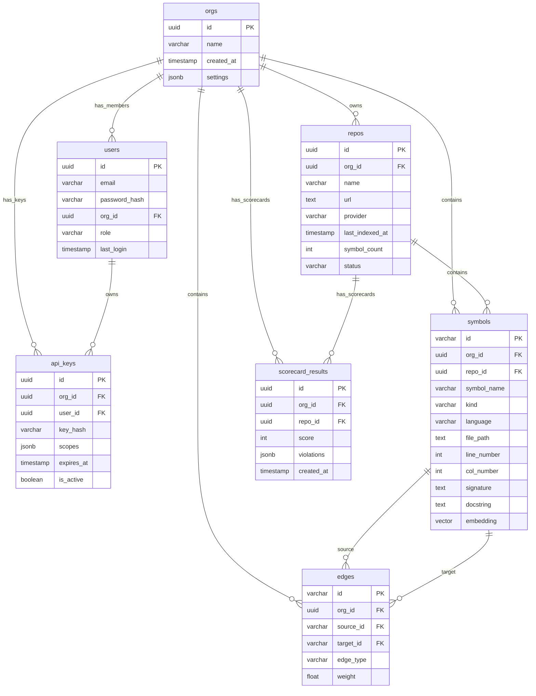
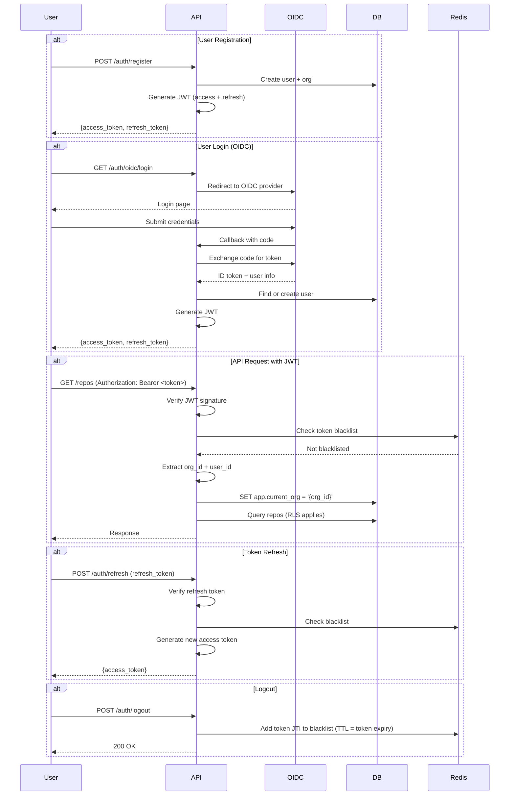

# Aethyme Stage 1: System Architecture

**Version:** 1.0
**Date:** 2025-11-22
**Status:** Design Complete
**Stage:** Stage 1 (CLI/Service-Grade Backend)

---

## Table of Contents

1. [Overview](#overview)
2. [High-Level Architecture](#high-level-architecture)
3. [Technology Stack](#technology-stack)
4. [Multi-Tenancy Design](#multi-tenancy-design)
5. [Data Model](#data-model)
6. [API Design](#api-design)
7. [Scaling Strategy](#scaling-strategy)
8. [Component Details](#component-details)
9. [Technology Decisions & Rationale](#technology-decisions--rationale)

---

## Overview

Aethyme Stage 1 delivers a **CLI-first, service-grade backend** with:
- Multi-tenant RLS PostgreSQL
- Redis caching layer
- JWT/OIDC authentication
- AI-readiness scorecard and safe autofixers
- Background workers for indexing
- Full observability (metrics, logs, traces)
- No frontend UI (Stage 2)

**Key Capabilities:**
- Index repositories (SCIP + tree-sitter fallback)
- Graph queries (search, ego, impact)
- AI-readiness scorecard (detects gaps in data-ui, docs, links, i18n)
- Safe autofixers (docs regen, link fixes, selector insertion)
- Guardrails (schema-first, drift sentinels, compaction, model routing)
- Telemetry and evals

---

## High-Level Architecture



### Data Flow Diagrams

#### 1. Indexing Flow



#### 2. Query Flow (with Cache)



#### 3. AI-Readiness Scorecard Flow



---

## Technology Stack

### Backend

| Component | Technology | Version | Rationale |
|-----------|-----------|---------|-----------|
| **API Framework** | FastAPI | 0.104+ | Async support, auto OpenAPI, Pydantic validation, high performance |
| **Language** | Python | 3.11+ | Rich ecosystem for parsers, type hints, async/await |
| **Database** | PostgreSQL | 15+ | RLS support, recursive CTEs, pgvector, JSONB, excellent for graphs |
| **Cache** | Redis | 7.0+ | Fast key-value store, pub/sub, rate limiting, session storage |
| **Task Queue** | Celery | 5.3+ | Distributed task execution, retries, scheduling, monitoring |
| **Message Broker** | Redis/RabbitMQ | 7.0+ / 3.12+ | Celery backend, reliable message delivery |
| **Indexing** | SCIP + tree-sitter | Latest | Multi-language code intelligence, fallback parsing |
| **Auth** | JWT + OIDC | - | Stateless auth, SSO integration, standard compliance |
| **ORM** | SQLAlchemy | 2.0+ | Async support, migrations (Alembic), type safety |

### Observability

| Component | Technology | Purpose |
|-----------|-----------|---------|
| **Metrics** | Prometheus | Counters, gauges, histograms for API/workers |
| **Dashboards** | Grafana | Visualization, alerting, SLO tracking |
| **Tracing** | Jaeger / OpenTelemetry | Distributed tracing, request flow analysis |
| **Logging** | Structured JSON logs + Loki | Centralized log aggregation, correlation IDs |

### Infrastructure

| Component | Technology | Purpose |
|-----------|-----------|---------|
| **Containerization** | Docker | Consistent environments, multi-stage builds |
| **Orchestration** | Kubernetes | Auto-scaling, rolling updates, health checks |
| **Secrets** | Kubernetes Secrets / Vault | Secure credential storage |
| **CI/CD** | GitHub Actions | Automated testing, deployment, security scans |
| **Registry** | Docker Hub / GCR | Container image storage |

### Development Tools

| Tool | Purpose |
|------|---------|
| **Poetry** | Python dependency management |
| **Black** | Code formatting |
| **Ruff** | Fast linting |
| **Pytest** | Testing framework |
| **mypy** | Static type checking |

---

## Multi-Tenancy Design

### Tenant Isolation Strategy

Aethyme uses **3-layer tenant isolation**:

1. **Application Layer** - `org_id` in JWT claims
2. **ORM Layer** - Automatic filtering via SQLAlchemy filters
3. **Database Layer** - Row-Level Security (RLS) policies (enforcement)

**Design Principle:** Defense in depth - even if application code fails, RLS prevents cross-tenant data leakage.

### Tenant Context Propagation

```python
# Middleware sets tenant context from JWT
@app.middleware("http")
async def tenant_context_middleware(request: Request, call_next):
    """Extract org_id from JWT and set PostgreSQL session variable."""

    # 1. Extract JWT from Authorization header
    token = request.headers.get("Authorization", "").replace("Bearer ", "")
    payload = verify_jwt(token)
    org_id = payload["org_id"]

    # 2. Set PostgreSQL session variable for RLS
    async with db.begin() as conn:
        await conn.execute(text(f"SET app.current_org = '{org_id}'"))

    # 3. Store in request state for application logic
    request.state.org_id = org_id
    request.state.user_id = payload["sub"]

    response = await call_next(request)
    return response
```

### RLS Policy Example

```sql
-- Enable RLS on symbols table
ALTER TABLE symbols ENABLE ROW LEVEL SECURITY;

-- Policy: Users can only see symbols from their organization
CREATE POLICY tenant_isolation_policy ON symbols
    USING (org_id = current_setting('app.current_org')::uuid);

-- Policy: Users can only insert symbols for their organization
CREATE POLICY tenant_isolation_insert ON symbols
    FOR INSERT
    WITH CHECK (org_id = current_setting('app.current_org')::uuid);

-- Apply to all multi-tenant tables
ALTER TABLE repos ENABLE ROW LEVEL SECURITY;
ALTER TABLE edges ENABLE ROW LEVEL SECURITY;
ALTER TABLE scorecard_results ENABLE ROW LEVEL SECURITY;
-- ... (see schema.sql for complete policies)
```

### Shared vs Dedicated Resources

| Resource | Model | Rationale |
|----------|-------|-----------|
| **API Instances** | Shared | Cost-efficient, auto-scaling handles load spikes |
| **Database** | Shared (RLS) | Simplifies operations, RLS ensures isolation |
| **Redis** | Shared (namespace prefix) | Key prefixes: `org:{org_id}:cache:{key}` |
| **Workers** | Shared (queue per org) | Queue naming: `indexing.{org_id}` for prioritization |
| **Storage (S3)** | Shared (prefix per org) | Bucket structure: `s3://aethyme/orgs/{org_id}/repos/{repo_id}/` |

**Upgrade Path:** For enterprise customers requiring dedicated infrastructure:
- Dedicated database instances (via connection pooling)
- Dedicated worker pools (Celery routing)
- Dedicated Redis instances

---

## Data Model

### Entity Relationship Diagram



### Key Tables

#### 1. Organizations (Tenants)

```sql
CREATE TABLE orgs (
    id UUID PRIMARY KEY DEFAULT gen_random_uuid(),
    name VARCHAR(255) NOT NULL,
    slug VARCHAR(100) UNIQUE NOT NULL,  -- URL-safe identifier
    created_at TIMESTAMP DEFAULT NOW(),
    settings JSONB DEFAULT '{}'::jsonb,  -- Tenant-specific config

    -- Soft delete
    deleted_at TIMESTAMP DEFAULT NULL
);

CREATE INDEX idx_orgs_slug ON orgs(slug);
```

**Purpose:** Top-level tenant isolation. Every resource belongs to an org.

#### 2. Repositories

```sql
CREATE TABLE repos (
    id UUID PRIMARY KEY DEFAULT gen_random_uuid(),
    org_id UUID NOT NULL REFERENCES orgs(id) ON DELETE CASCADE,
    name VARCHAR(255) NOT NULL,
    url TEXT NOT NULL,  -- git clone URL
    provider VARCHAR(50) NOT NULL,  -- 'github', 'gitlab', 'bitbucket'

    -- Indexing metadata
    last_indexed_at TIMESTAMP DEFAULT NULL,
    symbol_count INT DEFAULT 0,
    status VARCHAR(50) DEFAULT 'pending',  -- 'pending', 'indexing', 'completed', 'failed'
    error_message TEXT DEFAULT NULL,

    -- Timestamps
    created_at TIMESTAMP DEFAULT NOW(),
    updated_at TIMESTAMP DEFAULT NOW(),

    -- Multi-tenant constraint
    CONSTRAINT unique_repo_per_org UNIQUE(org_id, provider, url)
);

CREATE INDEX idx_repos_org ON repos(org_id);
CREATE INDEX idx_repos_status ON repos(status);
```

**Purpose:** Represents a Git repository being indexed.

#### 3. Symbols (Graph Nodes)

```sql
CREATE TABLE symbols (
    id VARCHAR(64) PRIMARY KEY,  -- Hash of (repo_id, file_path, symbol_name, line)
    org_id UUID NOT NULL REFERENCES orgs(id) ON DELETE CASCADE,
    repo_id UUID NOT NULL REFERENCES repos(id) ON DELETE CASCADE,

    -- Symbol metadata
    symbol_name VARCHAR(500) NOT NULL,
    kind VARCHAR(50) NOT NULL,  -- 'function', 'class', 'method', 'variable', 'import'
    language VARCHAR(50) NOT NULL,  -- 'python', 'typescript', 'javascript', etc.

    -- Location
    file_path TEXT NOT NULL,
    line_number INT NOT NULL,
    col_number INT DEFAULT 0,

    -- Code context
    signature TEXT,  -- Function signature or class definition
    docstring TEXT,  -- Documentation string
    text TEXT,  -- Source code snippet (20 lines context)

    -- Semantic search
    embedding vector(1536),  -- OpenAI ada-002 embedding

    -- Metadata
    indexed_at TIMESTAMP DEFAULT NOW(),

    CONSTRAINT unique_symbol UNIQUE(org_id, repo_id, file_path, symbol_name, line_number)
);

-- Performance indexes
CREATE INDEX idx_symbols_org ON symbols(org_id);
CREATE INDEX idx_symbols_repo ON symbols(repo_id);
CREATE INDEX idx_symbols_name ON symbols(symbol_name);
CREATE INDEX idx_symbols_kind ON symbols(kind);
CREATE INDEX idx_symbols_org_kind ON symbols(org_id, kind);

-- Semantic search index (pgvector)
CREATE INDEX idx_symbols_embedding ON symbols
    USING ivfflat (embedding vector_cosine_ops)
    WITH (lists = 100);
```

**Purpose:** Represents code symbols (functions, classes, etc.) - the nodes in the graph.

#### 4. Edges (Graph Relationships)

```sql
CREATE TABLE edges (
    id VARCHAR(64) PRIMARY KEY,  -- Hash of (source_id, target_id, edge_type)
    org_id UUID NOT NULL REFERENCES orgs(id) ON DELETE CASCADE,

    -- Relationship
    source_id VARCHAR(64) NOT NULL REFERENCES symbols(id) ON DELETE CASCADE,
    target_id VARCHAR(64) NOT NULL REFERENCES symbols(id) ON DELETE CASCADE,
    edge_type VARCHAR(50) NOT NULL,  -- 'calls', 'imports', 'extends', 'implements', 'contains'

    -- Metadata
    weight FLOAT DEFAULT 1.0,  -- Relationship strength (e.g., call frequency)
    created_at TIMESTAMP DEFAULT NOW(),

    CONSTRAINT unique_edge UNIQUE(org_id, source_id, target_id, edge_type)
);

-- Performance indexes
CREATE INDEX idx_edges_org ON edges(org_id);
CREATE INDEX idx_edges_source ON edges(source_id);
CREATE INDEX idx_edges_target ON edges(target_id);
CREATE INDEX idx_edges_type ON edges(edge_type);
CREATE INDEX idx_edges_org_source ON edges(org_id, source_id);
CREATE INDEX idx_edges_org_target ON edges(org_id, target_id);
```

**Purpose:** Represents relationships between symbols - the edges in the graph.

#### 5. Users

```sql
CREATE TABLE users (
    id UUID PRIMARY KEY DEFAULT gen_random_uuid(),
    email VARCHAR(255) UNIQUE NOT NULL,
    password_hash VARCHAR(255) NOT NULL,  -- bcrypt hash
    org_id UUID NOT NULL REFERENCES orgs(id) ON DELETE CASCADE,

    -- RBAC
    role VARCHAR(50) NOT NULL DEFAULT 'member',  -- 'admin', 'member', 'readonly'

    -- Metadata
    last_login TIMESTAMP DEFAULT NULL,
    created_at TIMESTAMP DEFAULT NOW(),
    updated_at TIMESTAMP DEFAULT NOW(),

    -- Soft delete
    deleted_at TIMESTAMP DEFAULT NULL
);

CREATE INDEX idx_users_email ON users(email);
CREATE INDEX idx_users_org ON users(org_id);
```

**Purpose:** User accounts with org membership and role-based access.

#### 6. API Keys

```sql
CREATE TABLE api_keys (
    id UUID PRIMARY KEY DEFAULT gen_random_uuid(),
    org_id UUID NOT NULL REFERENCES orgs(id) ON DELETE CASCADE,
    user_id UUID NOT NULL REFERENCES users(id) ON DELETE CASCADE,

    -- Key data
    name VARCHAR(100) NOT NULL,  -- User-friendly name
    key_hash VARCHAR(255) UNIQUE NOT NULL,  -- bcrypt hash of key
    key_prefix VARCHAR(16) NOT NULL,  -- First 8 chars for display (rgph_live_xxxxx...)

    -- Permissions
    scopes JSONB NOT NULL DEFAULT '["repo:read"]'::jsonb,  -- ["repo:read", "repo:write", "ai:scorecard"]

    -- Lifecycle
    expires_at TIMESTAMP DEFAULT NULL,
    last_used_at TIMESTAMP DEFAULT NULL,
    is_active BOOLEAN DEFAULT TRUE,
    created_at TIMESTAMP DEFAULT NOW(),

    CONSTRAINT unique_key_name UNIQUE(org_id, name)
);

CREATE INDEX idx_api_keys_org ON api_keys(org_id);
CREATE INDEX idx_api_keys_prefix ON api_keys(key_prefix);
CREATE INDEX idx_api_keys_active ON api_keys(is_active) WHERE is_active = TRUE;
```

**Purpose:** API key management for CI/CD and programmatic access.

#### 7. Scorecard Results

```sql
CREATE TABLE scorecard_results (
    id UUID PRIMARY KEY DEFAULT gen_random_uuid(),
    org_id UUID NOT NULL REFERENCES orgs(id) ON DELETE CASCADE,
    repo_id UUID NOT NULL REFERENCES repos(id) ON DELETE CASCADE,

    -- Scorecard data
    score INT NOT NULL CHECK (score >= 0 AND score <= 100),
    violations JSONB NOT NULL,  -- Array of violation objects with severity, file, line
    summary JSONB NOT NULL,  -- Summary stats by category

    -- Metadata
    created_at TIMESTAMP DEFAULT NOW(),
    created_by UUID REFERENCES users(id)
);

CREATE INDEX idx_scorecard_org ON scorecard_results(org_id);
CREATE INDEX idx_scorecard_repo ON scorecard_results(repo_id);
CREATE INDEX idx_scorecard_created ON scorecard_results(created_at DESC);
```

**Purpose:** Stores AI-readiness scorecard results.

### Indexes for Performance

**Query Pattern Analysis:**

| Query Type | Frequency | Optimization |
|------------|-----------|--------------|
| Symbol search by name | Very High | `idx_symbols_name`, `idx_symbols_org_kind` |
| Ego graph traversal | High | `idx_edges_org_source`, `idx_edges_org_target` |
| Impact analysis | High | `idx_edges_target` (reverse lookup) |
| Semantic search | Medium | `idx_symbols_embedding` (pgvector IVFFlat) |
| Repo status check | Very High | `idx_repos_status` |

**Index Maintenance:**
- Analyze tables after bulk inserts: `ANALYZE symbols;`
- Rebuild vector index periodically: `REINDEX INDEX idx_symbols_embedding;`
- Monitor index bloat: Use `pg_stat_user_indexes`

---

## API Design

### RESTful Endpoints

#### Authentication

| Method | Endpoint | Description | Auth |
|--------|----------|-------------|------|
| `POST` | `/auth/register` | Create new user + org | Public |
| `POST` | `/auth/login` | Login with email/password | Public |
| `POST` | `/auth/refresh` | Refresh access token | Refresh Token |
| `POST` | `/auth/logout` | Invalidate tokens | JWT |
| `GET` | `/auth/me` | Get current user | JWT |

#### Organizations

| Method | Endpoint | Description | Auth |
|--------|----------|-------------|------|
| `GET` | `/orgs/{org_id}` | Get org details | JWT (member) |
| `PATCH` | `/orgs/{org_id}` | Update org settings | JWT (admin) |
| `GET` | `/orgs/{org_id}/members` | List org members | JWT (member) |
| `POST` | `/orgs/{org_id}/members` | Invite member | JWT (admin) |

#### Repositories

| Method | Endpoint | Description | Auth |
|--------|----------|-------------|------|
| `POST` | `/repos` | Register a repository | JWT |
| `GET` | `/repos` | List org's repositories | JWT |
| `GET` | `/repos/{repo_id}` | Get repo details | JWT |
| `POST` | `/repos/{repo_id}/index` | Trigger indexing | JWT |
| `GET` | `/repos/{repo_id}/status` | Get indexing status | JWT |
| `DELETE` | `/repos/{repo_id}` | Delete repository | JWT (admin) |

#### Query Endpoints

| Method | Endpoint | Description | Auth |
|--------|----------|-------------|------|
| `GET` | `/query/search` | Search symbols | JWT or API Key |
| `GET` | `/query/ego` | Ego graph (N-hop neighbors) | JWT or API Key |
| `GET` | `/query/impact` | Impact analysis (reverse deps) | JWT or API Key |
| `GET` | `/query/semantic` | Semantic search | JWT or API Key |

**Example: Ego Graph Query**

```http
GET /query/ego?symbol=MyClass.myMethod&depth=2&limit=100
Authorization: Bearer eyJhbGc...

Response:
{
  "query": {
    "symbol": "MyClass.myMethod",
    "depth": 2,
    "org_id": "org_123"
  },
  "graph": {
    "nodes": [
      {
        "id": "sym_abc123",
        "symbol": "MyClass.myMethod",
        "kind": "method",
        "file": "src/myclass.py",
        "line": 42,
        "depth": 0
      },
      {
        "id": "sym_def456",
        "symbol": "helper_function",
        "kind": "function",
        "file": "src/utils.py",
        "line": 10,
        "depth": 1
      }
    ],
    "edges": [
      {
        "from": "sym_abc123",
        "to": "sym_def456",
        "type": "calls"
      }
    ]
  },
  "metadata": {
    "cached": false,
    "query_time_ms": 45,
    "total_nodes": 15,
    "total_edges": 23
  }
}
```

#### AI-Readiness Endpoints

| Method | Endpoint | Description | Auth |
|--------|----------|-------------|------|
| `POST` | `/ai-ready/{repo_id}` | Run AI-readiness scorecard | JWT |
| `GET` | `/ai-ready/{repo_id}/results` | Get latest scorecard | JWT |
| `GET` | `/ai-ready/{repo_id}/history` | Scorecard history | JWT |
| `POST` | `/autofix/{repo_id}` | Run autofixers | JWT |
| `GET` | `/autofix/{repo_id}/preview` | Dry-run autofix | JWT |

#### Status/Health Endpoints

| Method | Endpoint | Description | Auth |
|--------|----------|-------------|------|
| `GET` | `/health` | Health check | Public |
| `GET` | `/health/ready` | Readiness check | Public |
| `GET` | `/metrics` | Prometheus metrics | Internal |
| `GET` | `/jobs/{job_id}` | Get async job status | JWT |

### Authentication Flow



### Rate Limiting Strategy

**Token Bucket Algorithm** (Redis-backed):

```python
from datetime import timedelta
import redis

class RateLimiter:
    """Token bucket rate limiter."""

    def __init__(self, redis_client: redis.Redis):
        self.redis = redis_client

    async def check_rate_limit(
        self,
        key: str,  # e.g., "api:{org_id}" or "api:{api_key}"
        max_requests: int = 1000,
        window: timedelta = timedelta(minutes=1)
    ) -> bool:
        """
        Check if request is allowed under rate limit.

        Args:
            key: Unique identifier (org_id, user_id, or api_key)
            max_requests: Max requests per window
            window: Time window

        Returns:
            True if allowed, False if rate limited
        """
        bucket_key = f"ratelimit:{key}"
        current = await self.redis.get(bucket_key)

        if current is None:
            # First request in window
            await self.redis.setex(bucket_key, window, 1)
            return True

        if int(current) < max_requests:
            await self.redis.incr(bucket_key)
            return True

        # Rate limit exceeded
        return False
```

**Rate Limit Tiers:**

| Tier | Max Requests/Min | Max Requests/Hour | Use Case |
|------|------------------|-------------------|----------|
| **Free** | 60 | 1,000 | Trial users |
| **Pro** | 300 | 10,000 | Small teams |
| **Enterprise** | 1,000 | 100,000 | Large orgs |
| **Internal** | Unlimited | Unlimited | System operations |

**Rate Limit Headers:**

```http
HTTP/1.1 200 OK
X-RateLimit-Limit: 1000
X-RateLimit-Remaining: 957
X-RateLimit-Reset: 1638360000
Retry-After: 42  (if 429 Too Many Requests)
```

### API Versioning

**Strategy:** URL path versioning for major versions

```
/v1/repos          # Current stable API
/v2/repos          # Future breaking changes
```

**Deprecation Policy:**
- Minimum 6 months notice before deprecation
- Version support: N and N-1 (current + previous major version)
- Sunset header: `Sunset: Sat, 01 Jan 2026 00:00:00 GMT`

---

## Scaling Strategy

### Horizontal Scaling

**API Layer:**
- Stateless FastAPI instances (scale to N replicas)
- Load balancer distributes requests (round-robin or least connections)
- Auto-scaling based on CPU (target: 70%) and request rate

**Worker Layer:**
- Celery workers scale independently of API
- Queue-based load distribution
- Priority queues for different task types:
  - `high`: Real-time queries
  - `normal`: Indexing
  - `low`: Batch operations

**Configuration Example (Kubernetes HPA):**

```yaml
apiVersion: autoscaling/v2
kind: HorizontalPodAutoscaler
metadata:
  name: aethyme-api-hpa
spec:
  scaleTargetRef:
    apiVersion: apps/v1
    kind: Deployment
    name: aethyme-api
  minReplicas: 3
  maxReplicas: 20
  metrics:
  - type: Resource
    resource:
      name: cpu
      target:
        type: Utilization
        averageUtilization: 70
  - type: Pods
    pods:
      metric:
        name: http_requests_per_second
      target:
        type: AverageValue
        averageValue: "1000"
```

### Connection Pooling

**PostgreSQL Connection Pool (SQLAlchemy):**

```python
from sqlalchemy.ext.asyncio import create_async_engine, AsyncSession
from sqlalchemy.pool import NullPool

# Production configuration
engine = create_async_engine(
    DATABASE_URL,
    pool_size=20,          # Max connections per instance
    max_overflow=10,       # Overflow connections
    pool_pre_ping=True,    # Verify connections before use
    pool_recycle=3600,     # Recycle connections after 1 hour
    echo=False
)

# Connection limits:
# - PostgreSQL max_connections: 200
# - Reserve 20 for monitoring/admin
# - Available for app: 180
# - Per API instance: 20 (pool_size) + 10 (overflow) = 30
# - Max API instances: 180 / 30 = 6 instances
# - Use PgBouncer for connection pooling if need more instances
```

**PgBouncer for Higher Scale:**

```ini
[databases]
aethyme = host=postgres-primary port=5432 dbname=aethyme

[pgbouncer]
pool_mode = transaction       # Transaction-level pooling
max_client_conn = 1000        # Max client connections
default_pool_size = 25        # Pool size per database
reserve_pool_size = 5         # Reserved connections
```

### Read Replicas

**Read/Write Splitting:**

```python
class DatabaseRouter:
    """Route reads to replicas, writes to primary."""

    def __init__(self):
        self.primary = create_async_engine(PRIMARY_URL, ...)
        self.replicas = [
            create_async_engine(REPLICA1_URL, ...),
            create_async_engine(REPLICA2_URL, ...)
        ]
        self.replica_idx = 0

    def get_engine(self, operation: str):
        """Select engine based on operation."""
        if operation in ("INSERT", "UPDATE", "DELETE"):
            return self.primary
        else:
            # Round-robin across replicas
            engine = self.replicas[self.replica_idx % len(self.replicas)]
            self.replica_idx += 1
            return engine
```

**Replication Lag Monitoring:**

```sql
-- Monitor replication lag on replica
SELECT
    CASE
        WHEN pg_last_wal_receive_lsn() = pg_last_wal_replay_lsn()
        THEN 0
        ELSE EXTRACT(EPOCH FROM (now() - pg_last_xact_replay_timestamp()))
    END AS replication_lag_seconds;

-- Alert if lag > 5 seconds
```

### Caching Strategy

**Cache Layers:**

1. **Application Cache (Redis)** - 5 min TTL
   - Query results (ego graphs, impact analysis)
   - Symbol lookups
   - Scorecard results

2. **HTTP Cache** - 1 min TTL
   - Public endpoints (health, docs)
   - API responses with `Cache-Control` headers

**Cache Invalidation:**

```python
class CacheManager:
    """Intelligent cache invalidation."""

    async def invalidate_repo_cache(self, repo_id: str):
        """Invalidate all cache entries for a repository."""
        pattern = f"cache:repo:{repo_id}:*"
        keys = await self.redis.keys(pattern)
        if keys:
            await self.redis.delete(*keys)

    async def on_repo_indexed(self, repo_id: str):
        """Event handler: repo indexed -> invalidate caches."""
        await self.invalidate_repo_cache(repo_id)
        await self.invalidate_org_cache(repo.org_id)
```

### Performance Targets

| Metric | Target | Measurement |
|--------|--------|-------------|
| **API Latency (p95)** | <100ms | Auth, simple queries |
| **Search Queries (p95)** | <500ms | Cold cache |
| **Search Queries (cached)** | <50ms | Hot cache |
| **Ego Graph (p95)** | <2s | Depth 2-3 |
| **Impact Analysis (p95)** | <2s | Large graphs |
| **Indexing Small Repo** | <30s | <100 files |
| **Indexing Medium Repo** | <2min | 100-1000 files |
| **Indexing Large Repo** | <10min | 1000-10000 files |
| **Throughput** | 1000 req/s | Per API instance |
| **Concurrent Indexing** | 10 repos | Parallel workers |

---

## Component Details

### Indexing Service

**Responsibilities:**
- Clone Git repositories
- Run SCIP indexers (with fallback to tree-sitter)
- Extract symbols and relationships
- Store in PostgreSQL with RLS
- Update repo metadata

**Implementation:**

```python
class IndexingService:
    """Handles repository indexing."""

    async def index_repository(self, repo_id: str, org_id: str):
        """Index a repository."""
        repo = await self.db.get_repo(repo_id)

        # 1. Clone repository
        repo_path = await self.git_client.clone(repo.url)

        # 2. Run SCIP indexer
        try:
            scip_result = await self.scip_indexer.index(repo_path)
            symbols = scip_result.symbols
            edges = scip_result.edges
        except Exception as e:
            logger.warning(f"SCIP failed: {e}, using fallback")
            fallback_result = await self.fallback_indexer.index(repo_path)
            symbols = fallback_result.symbols
            edges = fallback_result.edges

        # 3. Add org_id and repo_id to all symbols
        for symbol in symbols:
            symbol.org_id = org_id
            symbol.repo_id = repo_id

        # 4. Bulk insert (PostgreSQL COPY for performance)
        await self.db.bulk_insert_symbols(symbols)
        await self.db.bulk_insert_edges(edges)

        # 5. Update repo metadata
        await self.db.update_repo(repo_id, {
            "status": "completed",
            "last_indexed_at": datetime.utcnow(),
            "symbol_count": len(symbols)
        })

        # 6. Invalidate caches
        await self.cache.invalidate_repo_cache(repo_id)

        # 7. Emit metrics
        self.metrics.histogram("indexing_duration_seconds",
                               time.time() - start_time,
                               tags={"repo_id": repo_id, "status": "success"})
```

### Scorecard Service

**Detectors:**

1. **Data-UI Selector Detector** - Check for `data-ui` attributes
2. **FOLDER Docs Detector** - Validate documentation indices
3. **Relative Links Detector** - Check for broken absolute links
4. **i18n Detector** - Find missing translations
5. **Schema/Route/Ability Detector** - Validate coverage

**Output:**

```json
{
  "repo_id": "repo_123",
  "score": 78,
  "summary": {
    "total_violations": 15,
    "blockers": 2,
    "warnings": 8,
    "info": 5
  },
  "violations": [
    {
      "severity": "blocker",
      "category": "data-ui",
      "message": "Missing data-ui selector on button",
      "file": "src/components/Button.tsx",
      "line": 42,
      "evidence": "<button onClick={...}>Submit</button>"
    }
  ],
  "created_at": "2025-11-22T10:30:00Z"
}
```

### Guardrails Service

**Features (from ROADMAP S1-T6):**

1. **Schema-First Planning** - Extract schemas before generation
2. **Drift Sentinels** - Detect when assumptions invalid
3. **Context Compaction** - Auto-summarize at 95% context limit
4. **Model Routing** - Select appropriate model for task (fast/balanced/powerful)
5. **Cost Tracking** - Log token usage and costs

---

## Technology Decisions & Rationale

### Why PostgreSQL over Neo4j for Graph Storage?

**Decision:** Use PostgreSQL with recursive CTEs instead of dedicated graph database (Neo4j, ArangoDB).

**Rationale:**
1. **Multi-tenancy:** PostgreSQL RLS provides built-in tenant isolation. Neo4j requires complex application-level filtering.
2. **Operational simplicity:** Team already familiar with PostgreSQL. One less system to operate.
3. **Performance:** Recursive CTEs with proper indexes handle graph queries efficiently for our scale (<10M nodes).
4. **Cost:** No additional licensing or infrastructure costs.
5. **Data co-location:** Symbols + metadata in one database (simpler joins, transactions).

**Trade-offs:**
- Graph queries slightly slower than Neo4j for very deep traversals (>5 hops)
- No native graph algorithms (shortest path, centrality) - can add pgRouting if needed

**Upgrade Path:** If graph queries become bottleneck, can:
1. Add dedicated graph database for hot queries
2. Use PostgreSQL as source of truth, sync to Neo4j
3. Implement hybrid approach (PostgreSQL + Neo4j)

### Why SCIP over Language Server Protocol (LSP)?

**Decision:** Use SCIP (Source Code Intelligence Protocol) as primary indexer.

**Rationale:**
1. **Designed for indexing:** SCIP is batch-oriented, optimized for whole-repo indexing. LSP is incremental/interactive.
2. **Multi-language:** Standardized format across languages (scip-python, scip-typescript, scip-java).
3. **Accurate:** Semantic analysis (not just regex), handles complex cases (overloading, generics).
4. **Industry adoption:** Used by Sourcegraph, GitHub Code Search.

**Trade-offs:**
- SCIP binaries required (deployment complexity)
- Fallback to tree-sitter for unsupported languages

### Why Celery over Cloud Functions (Lambda, Cloud Run)?

**Decision:** Use Celery workers instead of serverless functions for background tasks.

**Rationale:**
1. **State:** Celery workers can maintain warm connections (DB, Redis) across tasks. Serverless has cold start overhead.
2. **Cost:** For high-volume indexing, dedicated workers cheaper than per-invocation pricing.
3. **Control:** Fine-grained control over concurrency, retries, prioritization.
4. **Local development:** Easier to develop/debug locally vs serverless.

**Trade-offs:**
- Must manage worker infrastructure (K8s deployment)
- Less elastic than serverless (but HPA mitigates this)

**Hybrid Approach:** Use Cloud Functions for webhook handling (GitHub push events), Celery for long-running indexing.

### Why Redis over Memcached?

**Decision:** Use Redis for caching, rate limiting, and session storage.

**Rationale:**
1. **Data structures:** Redis supports lists, sets, sorted sets (needed for rate limiting).
2. **Persistence:** Optional AOF/RDB persistence for critical data.
3. **Pub/Sub:** Can use for real-time features (Stage 2).
4. **Atomic operations:** INCR, EXPIRE useful for rate limiting.

**Trade-offs:**
- Slightly higher memory usage than Memcached
- Single-threaded (but sufficient for our scale)

---

## Next Steps

1. **Review this architecture** with team and stakeholders
2. **Implement database schema** (`schema.sql`) - See next deliverable
3. **Define API contract** (OpenAPI spec) - See `api-contract.yaml`
4. **Set up infrastructure** (Kubernetes manifests) - See `deployment.md`
5. **Begin Stage 1 Task S1-T1** (Auth & RLS Hardening)

---

**Document Status:** ✅ Complete - Ready for Implementation
**Approvals Required:** Technical Lead, Product Manager, Security Team
**Estimated Review Time:** 2-3 days
